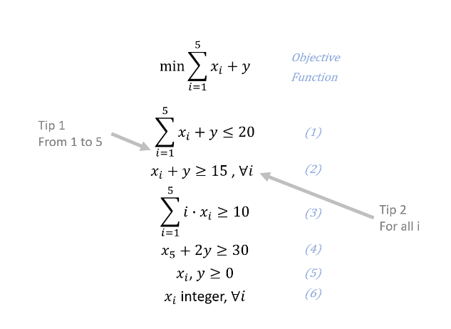

### Operation Research Problems

- To give a brief summary, optimization algorithms (operation research) are used to find optimal solutions for these problems.
- Here, Solvers such as CPLEX, Gurobi, GLPK, CBC, IPOPT, and Couenne are utilized solving problems.
- In all examples, `Pyomo` framework is used.
- Theoretical information and course details can be found via https://www.udemy.com/course/optimization-with-python-linear-nonlinear-and-cplex-gurobi/

- There are some problems that you have to solve to seek the solution of optimization problems such as linear programming (LP), mixed-integer programming (MILP), nonlinear programming (NLP), mixed-integer nonlinear programming (MINLP), and constraint programming (CP).

- Above problem is solved using `MILP.py` file.

- Columns in `train.csv' dataset are:
  - id

