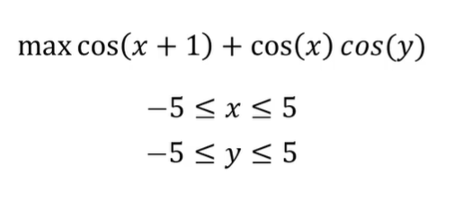
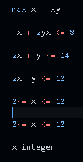

### Operation Research Problems

- To give a brief summary, optimization algorithms (operation research) are used to find optimal solutions for these problems.
- Here, Solvers such as CPLEX, Gurobi, GLPK, CBC, IPOPT, and Couenne are utilized solving problems. In order for python codes to work, you need to install the aforementioned solvers.
- In all examples, `Pyomo` framework is used.
- Theoretical information and course details can be found via https://www.udemy.com/course/optimization-with-python-linear-nonlinear-and-cplex-gurobi/

- There are some problems that you have to solve to seek the solution of optimization problems such as linear programming (LP), mixed-integer programming (MILP), nonlinear programming (NLP), mixed-integer nonlinear programming (MINLP), and constraint programming (CP).

| MILP Problem | NLP Problem | MINLP Problem |
|---------|---------|---------|
|  |  |  |

- MILP Problem is solved using `MILP.py` file.
- NLP Problem is solved using `NLP.py` file.
- MINLP Problem is solved using `MNILP.py` file.

# Which Framework

| Framework | Linear Problems | Nonlinear Problems | How easy to start with | How easy to configure a new solver and about documentation |
|:----------:|:----------:|:----------:|:----------:|:----------:|
| Pyomo | X | X | High | High |
| Ortools | X |  | Very High | Low |
| PuLP | X |  | High | High |
| SCIP | X | X | Very High | Not possible / Low |
| SciPY | X | X | Low | Medium |

# Which Solver

| Solver | Linear| Nonlinear | Free / Commercial |
|:----------:|:----------:|:----------:|:----------:|
| Gurobi | X |  | Commercial |
| Cplex | X |  | Commercial|
| CBC | X |  | Free|
| GLPK | X |  | Free |
| IPOPT |  | X | Free |
| SCIP | X | X | Free |
| Baron | | X | Commercial |
